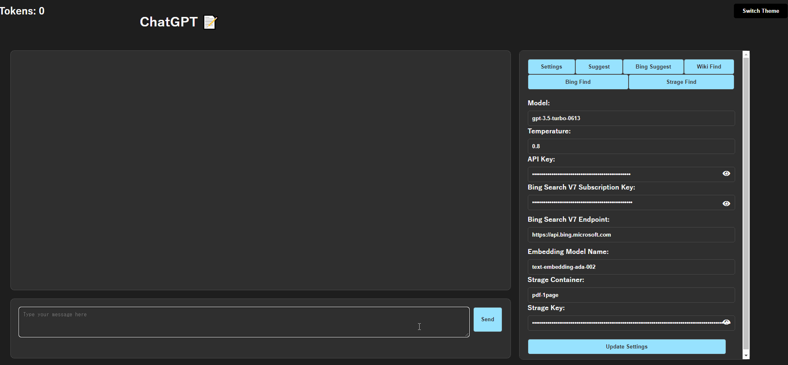
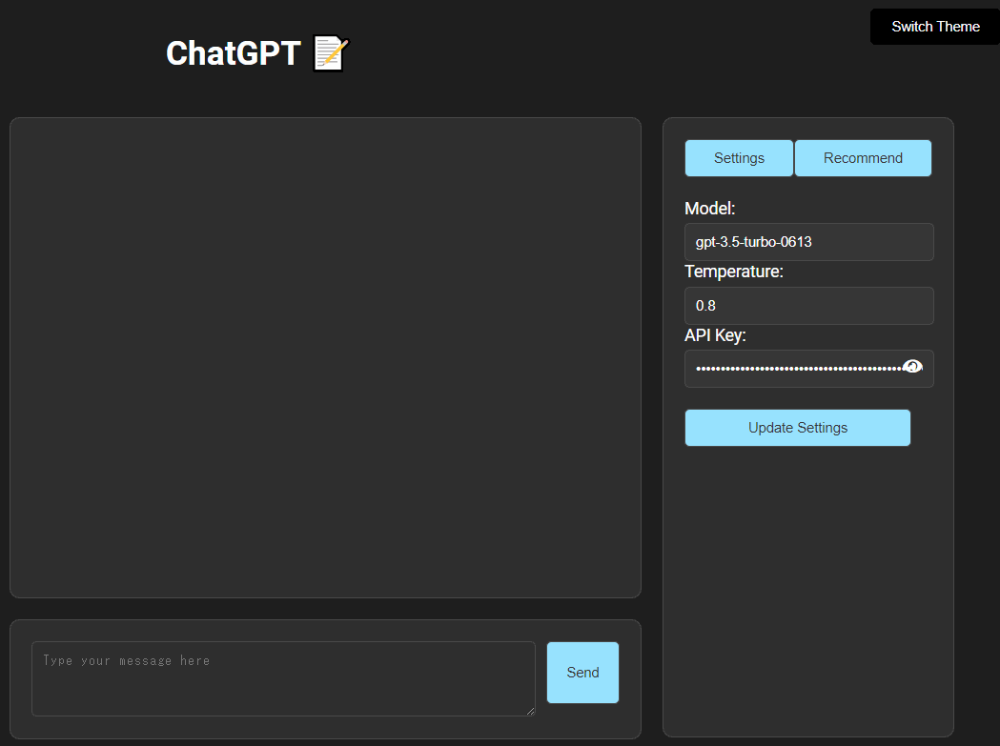
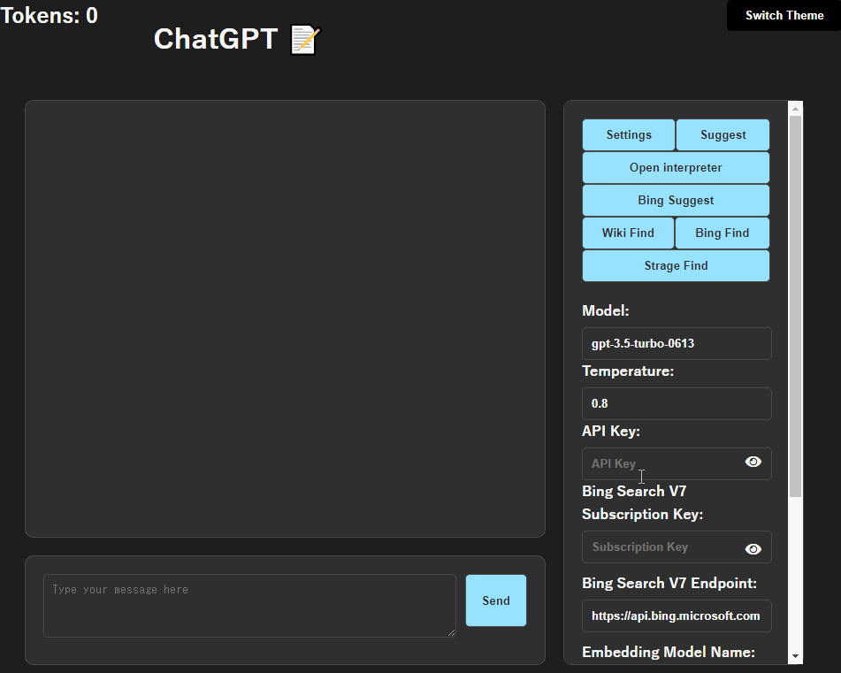
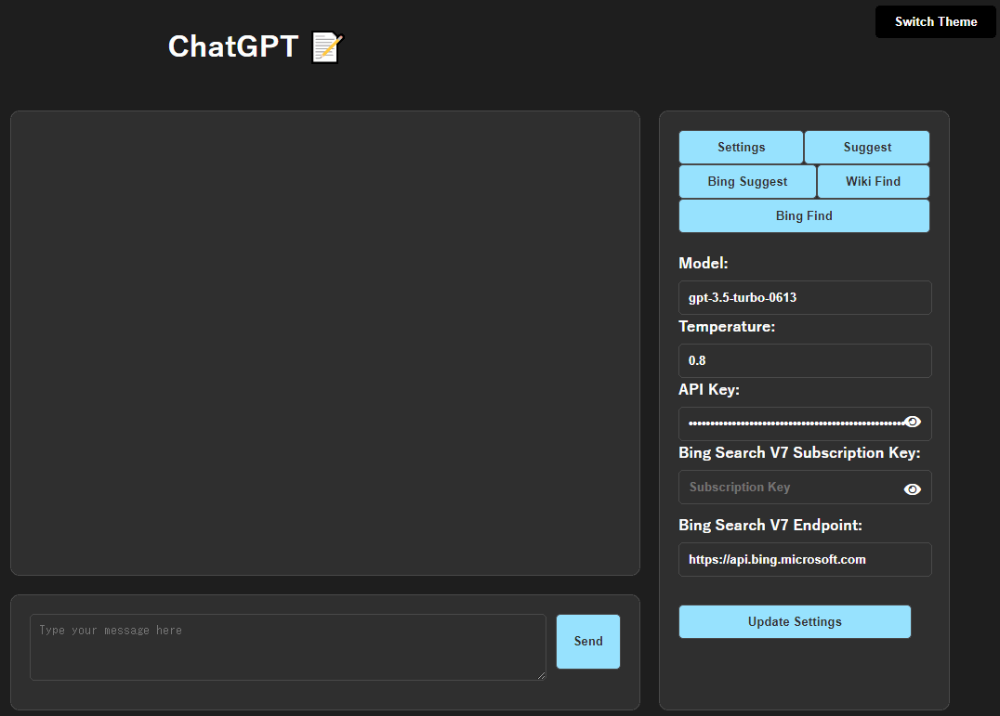
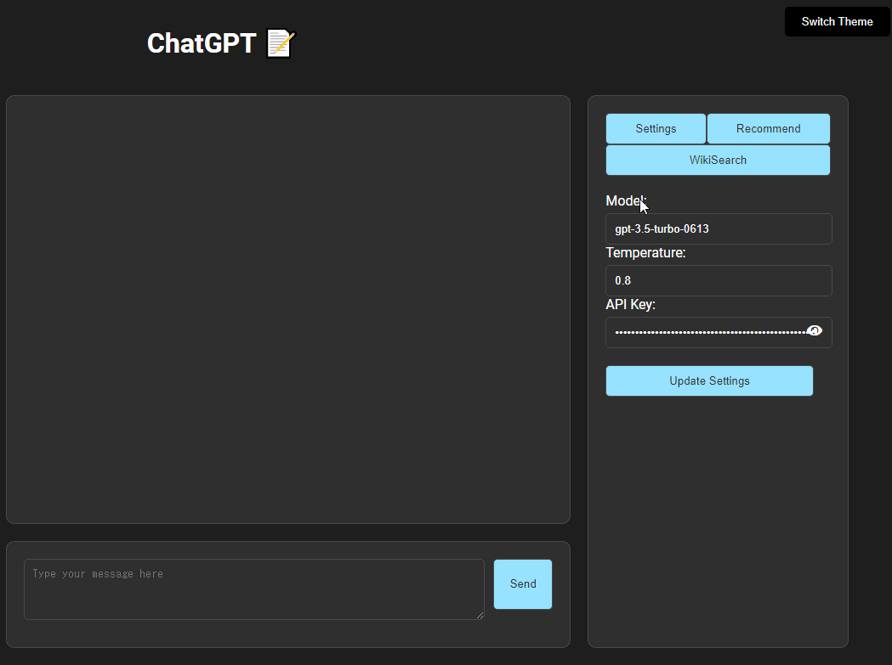
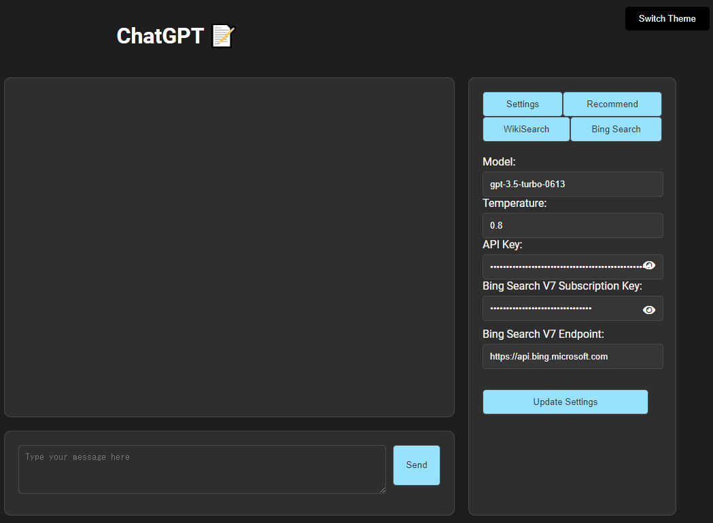
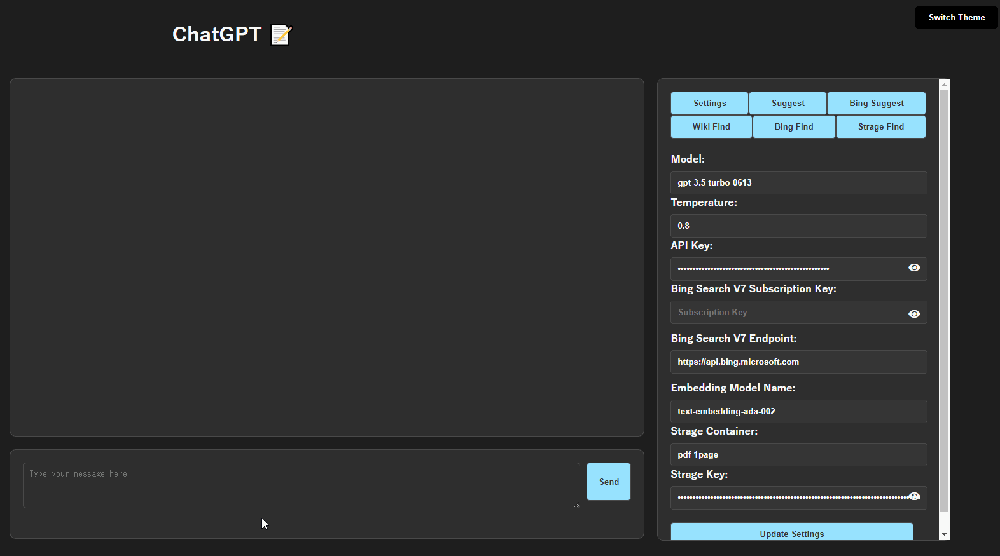

# ChatGPTを使用するためのUI

Azure Openai には非対応

- ModelにOpenai APIで使用したいモデル名を指定してください
- Tempratureにはモデルの創造性を指定してください
- API KEYにはOpenai APIで発行した自分のAPIを指定してください
- Ctrl+Enterで送信
- Enterで改行
- 背景色の切り替え機能
- 短期記憶を追加
- 使用トークン数の出力



## 次の推奨質問の表示

Making Recommendationsにチェックを入れると
そのあとに入力したメッセージの回答の次のメッセージとしておすすめの質問をいくつか生成します。

推奨質問はクリックすると自動で入力欄に入力されます。



##  Open interpreter

Open interpreterにチェックを入れると
そのあとに入力したメッセージの回答として最大3回APIを使い、ステップバイステップで主にコードを生成します



## 次の推奨質問をChatGPTの回答とBing検索を参考に表示

Enable Recommend Bing Searchにチェックを入れると
そのあとに入力したメッセージの回答とそれに関連するBing検索結果を参考に、次におすすめの質問をいくつか生成します。

推奨質問はクリックすると自動で入力欄に入力されます。



## 回答に関連する内容をWiki検索して要約する

Making Wiki Searchにチェックを入れることで
GPTの応答の結果を単語に要約し、要約した単語を検索して結果を要約して表示します。

クリックすると自動で入力欄に入力されます



## 回答に関連する内容をBing検索して要約する

Bing Search APIを使用して、
Enable Bing Searchにチェックを入れることで
GPTの応答の結果を単語に要約し、要約した単語を検索して結果を要約して表示します。

クリックすると自動で入力欄に入力されます



## Azure Blob Storage に格納されたデータをOpenAIのEmbeddingsで検索

事前にAzure Blob Storageに文章と対応する文章を埋め込みベクトルに変換したデータを使い
ユーザーの問い合わせと類似する文章をAzure Blob Storage から検索して表示します。

cos類似度が0.8を超えないものは検索対象にせずその中で最大3件の文章を表示します。
もし該当する文章が無ければ「類似文章が見当たりませんでした。」と回答します。



### 文章の埋め込みベクトル化して格納する

```python
from tqdm import tqdm
from glob import glob
import pandas as pd
import openai
from openai.embeddings_utils import get_embedding, cosine_similarity
import os
from PyPDF2 import PdfReader
import pdfplumber
from azure.storage.blob import BlobServiceClient, BlobClient, ContainerClient

# OpenAI settings
openai.api_key = "<your-openai-api>"

# Azure Storage settings
connection_string = "<your-azure-storage-connection-string>"
container_name = "<your-container-name>"
# コンテナが存在しない場合にのみコンテナを作成します。
try:
    blob_service_client.create_container(container_name)
    print(f"Container '{container_name}' created.")
except Exception as e:
    print(f"Container '{container_name}' already exists.")
```

    Container '<your-container-name>' already exists.


```python
# Get the list of files to convert
files = glob('./data/*')
for file in files:
    # Open the PDF file
    pdf_reader = PdfReader(file)

    # Extract the file name from the file path
    file_name = os.path.basename(file)

    # Create an empty DataFrame to store the text and its embedding
    df = pd.DataFrame(columns=['text', 'embedding', 'page_num'])

    # Loop through each page in the PDF
    for page_num in tqdm(range(len(pdf_reader.pages))):
        # Extract the text from the page
        with pdfplumber.open(file) as pdf:
            page = pdf.pages[page_num]
            text = page.extract_text()

        # Convert the text to an embedding vector using OpenAI's API
        response = openai.Embedding.create(input=text, model="text-embedding-ada-002")
        embedding_vector = response['data'][0]['embedding']

        # Add the text, its embedding, and the page number to the DataFrame
        new_df = pd.DataFrame({'text': [text], 'embedding': [embedding_vector], 'page_num': [page_num]})
        df = pd.concat([df, new_df], ignore_index=True)

    # Convert the DataFrame to a CSV string
    csv_string = df.to_csv(index=False)

    # Create a blob client
    blob_client = blob_service_client.get_blob_client(container_name, f'{file_name}.csv')

    # Upload the CSV data to Azure Storage
    # blob_client.upload_blob(csv_string, blob_type="BlockBlob")
    blob_client.upload_blob(csv_string, blob_type="BlockBlob", overwrite=True)

```

    100%|██████████| 24/24 [00:10<00:00,  2.33it/s]

