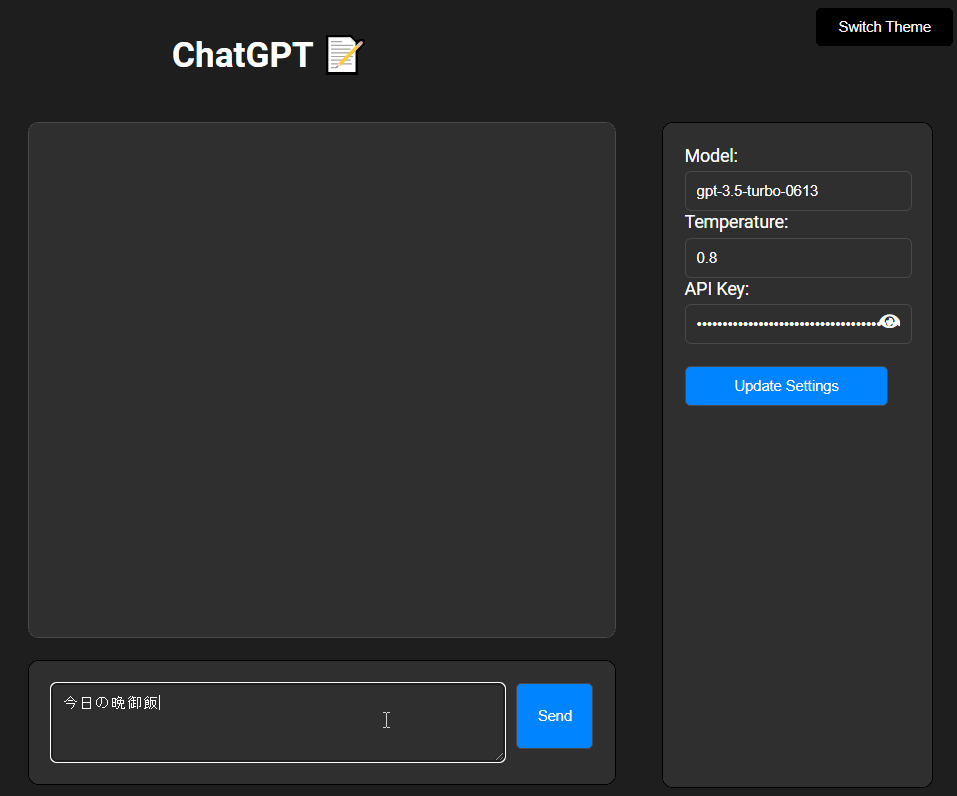

# ChatGPTを使用するためのUI

Azure Openai には非対応

- ModelにOpenai APIで使用したいモデル名を指定してください
- Tempratureにはモデルの創造性を指定してください
- API KEYにはOpenai APIで発行した自分のAPIを指定してください
- Ctrl+Enterで送信
- Enterで改行
- 背景色の切り替え機能
- 短期記憶を追加

## 次の推奨質問の表示

Making Recommendationsにチェックを入れると
そのあとに入力したメッセージの回答の次のメッセージとしておすすめの質問をいくつか生成します。

推奨質問はクリックすると自動で入力欄に入力されます。

## 次の推奨質問をChatGPTの回答とBing検索を参考に表示

Enable Recommend Bing Searchにチェックを入れると
そのあとに入力したメッセージの回答とそれに関連するBing検索結果を参考に、次におすすめの質問をいくつか生成します。

推奨質問はクリックすると自動で入力欄に入力されます。

## 回答に関連する内容をWiki検索して要約する

Making Wiki Searchにチェックを入れることで
GPTの応答の結果を単語に要約し、要約した単語を検索して結果を要約して表示します。

クリックすると自動で入力欄に入力されます

## 回答に関連する内容をBing検索して要約する

Bing Search APIを使用して、
Enable Bing Searchにチェックを入れることで
GPTの応答の結果を単語に要約し、要約した単語を検索して結果を要約して表示します。

クリックすると自動で入力欄に入力されます

